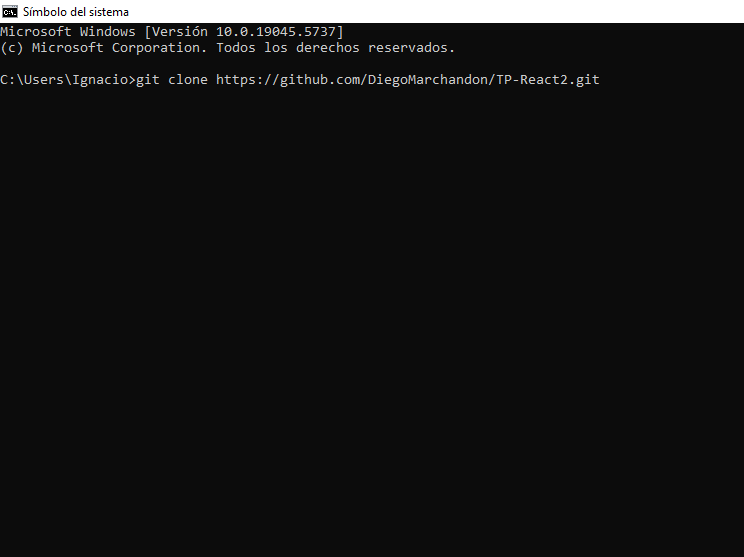
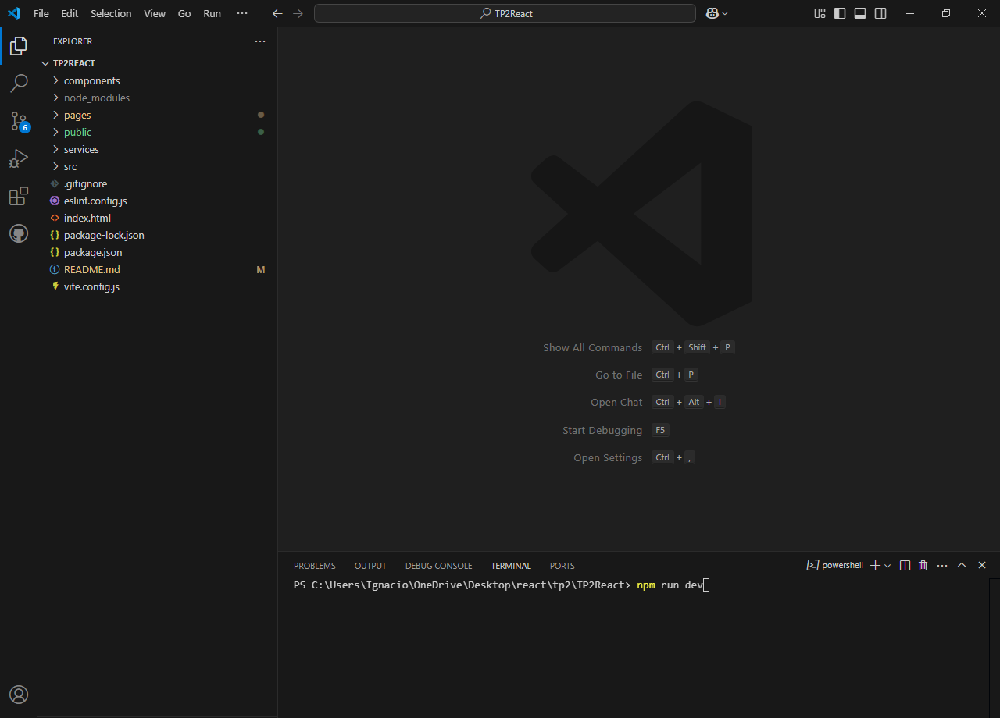
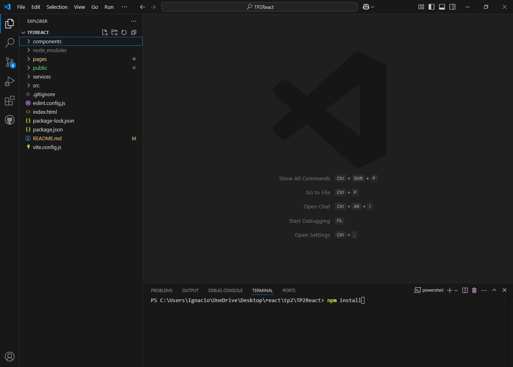
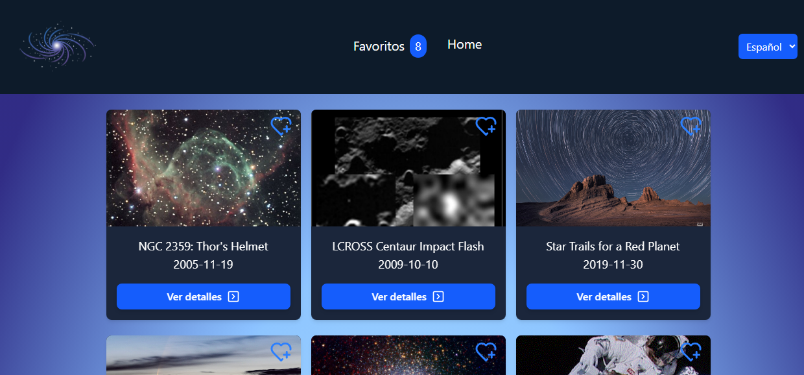

# Trabajo Práctico: REACT

## integrantes: 
- **Ariel Mamani** FAI-3607
- **Diego Marchandon** FAI-4886
- **Ignacio Araya** FAI-836

## Instrucciones:
El sistema puede ser corrido directamente desde la aplicación Vercel a través del siguiente link:
 - **Agregar**

Para ejecutarlo de manera local, es necesario clonar el proyecto e instalar las siguientes dependencias:
<h3>Instalación paso por paso</h3>
<ol>
    <li>
        Para instalar la aplicación nos posicionamos con una terminal en la carpeta donde queremos descargarla y ejecutamos el siguiente comando:
        git clone https://github.com/DiegoMarchandon/TP-React2.git
        
    </li>
    <li>
        Una vez clonado nos posicionamos en la carpeta del proyecto(TP2React), abrimos el terminal y usamos el comando <strong>npm install</strong> para instalar las dependencias necesarias que se listan en el archivo <b>package.json</b>
        
    </li>  
    <li>
        Después de que todo se instala usamos el comando <strong>npm run dev</strong>
        
    </li>
    <li>
        Y finalmente se abre la app en el navegador predeterminado
        
    </li>
</ol>

## Descripción del proyecto: 
Desarrollar una SPA con React y Tailwind que consuma datos desde una API simulada, que
incluya navegación entre páginas, búsqueda, idioma en español e inglés, y persistencia de
preferencias del usuario. Se tendrá una página de home donde muestre una lista de
elementos en forma de cards o tarjetas y permita al usuario ver detalles adicionales al hacer
click en un elemento. También se desarrollará una página de elementos favoritos del
usuario.

## Instrucciones para el Desarrollo:

1) Elegir un dominio adecuado para resolver la consigna. Es totalmente libre de
elección.
2) Crear un proyecto react y agregarlo a un repositorio de Github o crear un repositorio
en github, clonarlo y luego crear el proyecto.
    a) Compartir el link del repositorio con los profesores en la planilla de los grupos.
3) Instalar Tailwind CSS y configurarlo dentro del proyecto.
    a) https://tailwindcss.com/docs/installation
4) Desarrollar la aplicación siguiendo los requerimientos.
5) Analizar y crear los componentes que sean necesarios para cumplir los objetivos.
6) Documentar decisión importante de diseño o código en el readme.md.

